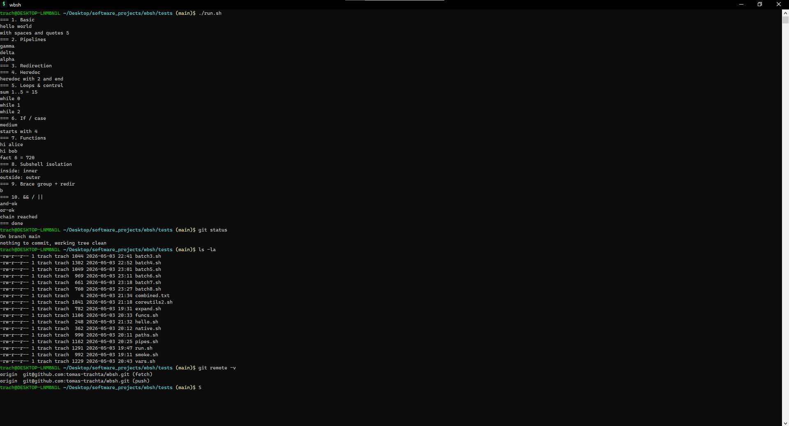

# wbsh

A Bash-compatible shell for Windows. Drop-in replacement for Git Bash, built
from scratch in C++17 with a POSIX shell grammar, ANSI-aware line editing,
and a curated set of bundled coreutils so a fresh install is useful out of
the box.



> Status: **alpha** — most of the surface area below is implemented, but
> wbsh has not yet had a tagged 1.0 release, the test suite is light, and
> behavior may change. Use at your own risk for non-critical workflows.

---

## Why wbsh

Git Bash works, but it is a thin re-skin of MSYS2 with quirks that leak
through (PATH translation surprises, sluggish `fork`-on-Windows, an aging
MinTTY). wbsh aims to be cleaner integration for modern Windows:

- **Native console first.** Uses `SetConsoleMode` with virtual-terminal
  processing and DWM immersive dark-mode. Renders correctly in Windows
  Terminal, conhost, VS Code's integrated terminal, and JetBrains terminals.
- **Single self-contained binary.** No MSYS layer, no Cygwin DLL. The exe
  is ~1 MB; the installer is ~2.5 MB including the VC++ runtime.
- **Bash semantics, not approximations.** Real lexer + parser + AST +
  expander — not a regex hack on top of `cmd.exe`.
- **Bundled coreutils.** `ls`, `grep`, `sed`, `awk`, `find`, `xargs`,
  `tar`, `gzip`, `curl`, hashes, etc. are built in, so you can script
  before installing anything else. System `git`, `vim`, `less` etc. are
  auto-discovered on PATH.
- **POSIX path translation.** `/c/Users/...` ↔ `C:\Users\...` Cygwin/MSYS-style
  conversion when invoking native Windows .exe.

---

## Install

### Installer (recommended)

Download `wbsh-setup-x64.exe` from the [Releases](#) page and run it. The
installer is **per-user** (no UAC) and offers two opt-in tasks:

- Add `wbsh` to your user `PATH`.
- Register an "Open wbsh here" entry in the Explorer right-click menu.

Default install location is `%LOCALAPPDATA%\Programs\wbsh`.

### Portable ZIP

Download `wbsh-<version>-portable-x64.zip`, extract, and run `wbsh.exe`.
No registry, no PATH changes, no install. Ships the same VC++ runtime
DLLs alongside the binary.

### winget / scoop

Pending — not yet published.

---

## Quick start

```sh
$ wbsh
wbsh -- bash front-end + executor (Windows)
   type `exit` or press Ctrl-D to quit
trach@DESKTOP /c/Users/trach (main)$ ls
Documents  Downloads  Desktop  ...

trach@DESKTOP /c/Users/trach (main)$ for f in *.cpp; do echo "$f -> $(wc -l < "$f") lines"; done
src/main.cpp -> 980 lines
src/parser.cpp -> 1240 lines
```

Pipelines, redirection, control flow, functions, command substitution,
arithmetic expansion, brace expansion, parameter expansion, glob
expansion, here-docs, here-strings, traps — all work.

```sh
$ wbsh -c 'echo "$((6 * 7))"'
42

$ wbsh -c 'for i in {1..5}; do printf "%02d\n" "$i"; done'
01
02
03
04
05
```

---

## Command-line interface

```
wbsh                          interactive shell (TTY auto-detect)
wbsh [opts] -c <command>      run / dump the given string
wbsh [opts] <file>            run / dump the file (- for stdin)

modes (default for files = dump AST):
  -i, --interactive           force interactive REPL
  -r, --run                   actually execute the script
  -e, --expand                walk the AST and dump expanded words
  -t, --tokens                dump the token stream
  --no-ast                    suppress the AST dump
  -h, --help                  show help
```

The default no-`-r` behavior of dumping the AST is a debugging aid — useful
when developing wbsh itself. Pass `-r` to actually execute scripts.

---

## Configuration

### `~/.wbshrc`

Sourced once at the start of every interactive session. Set aliases,
export environment variables, define functions, override `PS1`:

```sh
# ~/.wbshrc
export EDITOR=code
export PAGER=less

alias ll='ls -lah'
alias gs='git status'
alias ..='cd ..'

# A custom prompt: bright-magenta cwd, branch in yellow.
PS1='\[\e[35;1m\]\w\[\e[0m\]\g \$ '
```

### Environment variables

| Variable    | Effect                                                          |
|-------------|-----------------------------------------------------------------|
| `PS1`       | Primary prompt. Escapes documented below.                       |
| `PS2`       | Continuation prompt for multi-line input (default `> `).        |
| `PATH`      | Stored in POSIX form (`/c/Users/...`). Auto-translated for spawns. |
| `HOME`      | Defaults to `%USERPROFILE%`, normalized to POSIX form.          |
| `HISTFILE`  | History file (default `$HOME/.wbsh_history`).                   |
| `HISTSIZE`  | Max in-memory history entries.                                  |
| `COLUMNS`, `LINES` | Auto-updated on window resize; fires the `WINCH` trap.   |

### `PS1` / `PS2` escapes

| Escape | Expands to |
|--------|------------|
| `\u`   | `$USER` (or `%USERNAME%`) |
| `\h` / `\H` | short / long hostname |
| `\w`   | working directory (POSIX, with `~` for `$HOME`) |
| `\W`   | basename of the working directory |
| `\g`   | ` (branch)` when inside a git repo, yellow on a TTY |
| `\t`   | `HH:MM:SS` |
| `\s`   | literal `wbsh` |
| `\n` `\r` `\a` `\e` `\\` `\$` | the obvious things |
| `\[` `\]` | non-printing region markers (currently elided) |

Default `PS1` (with color):

```
\[\e[32;1m\]\u@\h\[\e[0m\] \[\e[36;1m\]\w\[\e[0m\]\g\$
```

---

## Bundled builtins

### Shell builtins
`:`, `true`, `false`, `echo`, `printf`, `exec`, `pwd`, `cd`, `exit`, `return`,
`break`, `continue`, `export`, `unset`, `shift`, `set`, `eval`, `source` /
`.`, `type`, `command`, `read`, `test` / `[`, `local`, `alias`, `unalias`,
`history`, `trap`, `getopts`, `declare` / `typeset`, `mapfile` / `readarray`,
`shopt`, `let`, `umask`, `hash`, `times`, `caller`, `help`, `compgen`,
`complete`, `compopt`, `readonly`, `jobs`, `wait`, `fg`, `bg`, `disown`.

### Coreutils (built in, no external dependency)
`ls`, `cat`, `clear`, `which`, `mkdir`, `rmdir`, `rm`, `cp`, `mv`, `touch`,
`head`, `tail`, `wc`, `whoami`, `hostname`, `env`, `sleep`, `basename`,
`dirname`, `sort`, `uniq`, `tr`, `cut`, `tee`, `paste`, `tac`, `rev`, `nl`,
`date`, `seq`, `uname`, `id`, `realpath`, `readlink`, `expr`, `grep`, `find`,
`xargs`, `pushd`, `popd`, `dirs`, `xxd`, `od`, `fold`, `column`, `expand`,
`unexpand`, `comm`, `yes`, `nproc`, `tput`, `mktemp`, `kill`, `sed`, `awk` /
`gawk`, `bc`, `gzip`, `gunzip`, `zcat`, `zip`, `unzip`, `stat`, `chmod`, `ln`,
`cmp`, `diff`, `du`, `df`, `md5sum`, `sha1sum`, `sha256sum`, `sha512sum`,
`base64`, `curl`, `tar`.

`git`, `vim`/`vi`, `less`, `ssh`, etc. are not bundled — wbsh expects them on
PATH and auto-discovers `git` from the standard install locations
(`Program Files\Git\cmd`, scoop, chocolatey, …).

---

## Building from source

### Requirements

- Windows 10 1903+ (for VT-mode console + immersive dark mode).
- Visual Studio 2022 or Build Tools 2022 with the **Desktop development with
  C++** workload (provides MSBuild + MSVC v143 + Windows 10 SDK).
- (Optional, for the installer) [Inno Setup 6](https://jrsoftware.org/isdl.php)
  — install via `winget install JRSoftware.InnoSetup`.

### Compile

```powershell
# From the repo root.
& "$env:ProgramFiles\Microsoft Visual Studio\2022\Community\MSBuild\Current\Bin\MSBuild.exe" `
    .\wbsh.vcxproj -p:Configuration=Release -p:Platform=x64
```

The binary lands at `x64\Release\wbsh.exe`.

For a Debug build, swap `Release` → `Debug`. The Debug binary requires the
Debug VC++ runtime (`/MDd`) and is not redistributable.

### Build the installer + portable ZIP

```powershell
.\installer\build.ps1                        # default: 0.1.0
.\installer\build.ps1 -Version 0.2.0         # versioned
```

This builds Release|x64, stages `wbsh.exe` plus the VC++ runtime DLLs,
emits `installer\output\wbsh-<ver>-portable-x64.zip` and (if Inno Setup is
installed) `installer\output\wbsh-setup-x64.exe`.

---

## Project layout

```
src/
  main.cpp          REPL, CLI dispatch, prompt expansion, console setup
  lexer.cpp/h       POSIX shell tokenizer
  parser.cpp/h      Recursive-descent parser → AST
  ast.h             AST node definitions
  expander.cpp/h    Parameter / arithmetic / command / glob / brace expansion
  executor.cpp/h    Pipeline + redirection + process spawn + control flow
  environment.cpp/h Variable + export semantics
  builtins.cpp      Shell builtins (cd, export, declare, trap, jobs, …)
  coreutils.cpp     Bundled coreutils (ls, grep, sed, awk, tar, gzip, curl, …)
  awk.cpp/h         Embedded awk implementation
  inflate.cpp/h     gzip/zip decoder
  lineedit.cpp/h    Line editor: history, kill ring, completion hooks
  pathconv.cpp/h    POSIX ↔ Windows path translation
  printer.cpp/h     Token / AST dump pretty-printer
  source.h          Source-location helpers shared by lexer/parser

tests/              Hand-written .sh smoke scripts (run via run.sh)

installer/
  wbsh.iss          Inno Setup script (per-user, PATH, context menu)
  wbsh-here.cmd     Wrapper used by the "Open wbsh here" verb
  build.ps1         Driver: builds Release, stages payload, runs ISCC
```

---

## Testing

```sh
# After building wbsh.exe, from the tests/ directory:
..\x64\Release\wbsh.exe -r run.sh
```

Each `tests/*.sh` script is a hand-written smoke check exercising one
slice of behavior (pipelines, redirection, expansion, control flow, etc.).
There is currently **no automated test runner or CI**; contributions to add
one are welcome.

---

## Comparison

|                          | wbsh         | Git Bash      | MSYS2          | Cygwin       | WSL              |
|--------------------------|--------------|---------------|----------------|--------------|------------------|
| Native Windows binary    | yes          | yes (MSYS)    | yes (MSYS)     | yes          | no (Linux VM)    |
| Single-binary install    | **yes**      | no            | no             | no           | no               |
| Coreutils bundled        | **yes**      | yes (MSYS)    | yes (pacman)   | yes          | yes              |
| Modern console (VT mode) | **yes**      | MinTTY        | MinTTY         | MinTTY       | n/a              |
| `fork()` emulation       | spawn-only   | full (slow)   | full (slow)    | full (slow)  | n/a              |
| Path translation         | yes          | yes           | yes            | yes          | yes              |
| Real Linux syscalls      | no           | no            | no             | no           | yes              |

wbsh trades full POSIX behavior for being small, fast to start, and clean
to integrate. If you need a real Linux environment, use WSL.

---

## Roadmap

Major bets that are in progress or planned:

- True ConPTY for child processes (real PTY semantics, not just inherited console).
- Tab completion (programmable + filename + command + variable).
- Reverse-incremental search (`Ctrl-R`).
- Full job control (`Ctrl-Z`, `fg`, `bg`).
- Process substitution (`<(...)`, `>(...)`).
- Optional package manager for adding tools.
- Code-signed releases.

---

## Contributing

Pull requests welcome. Please:

1. Match the existing style (tabs for indentation in `src/`, 4-column tabs).
2. Keep changes focused — one feature or fix per PR.
3. Add or update a `tests/*.sh` script when changing executor behavior.
4. Verify a clean Release build (`installer\build.ps1`) before opening the PR.

Bug reports should include the wbsh version (`wbsh --help`'s banner line),
Windows build, and the smallest script that reproduces the issue.

---

## License

[MIT](./LICENSE) © 2026 Tomas Trachta.
