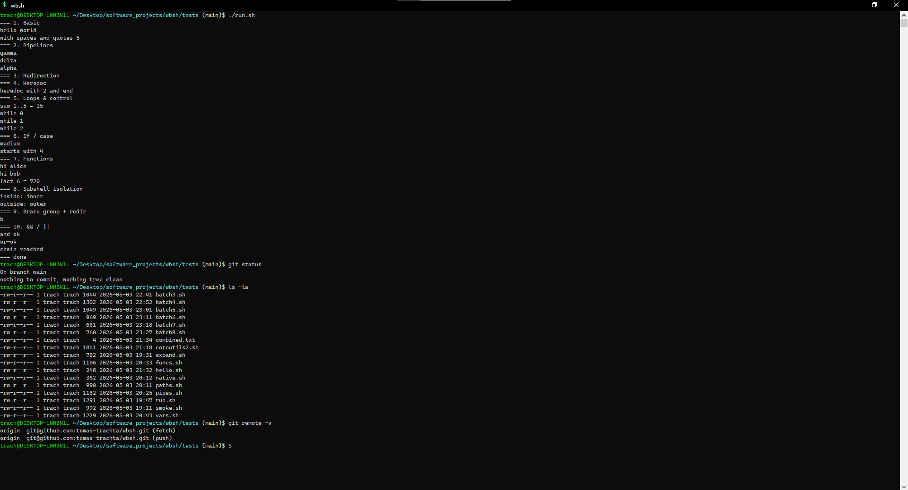
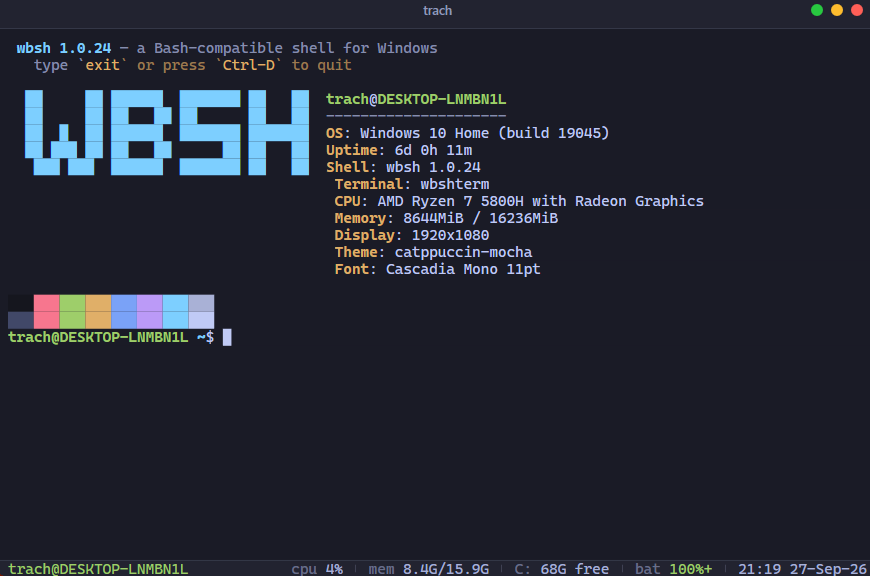

# wbsh

A Bash-compatible shell for Windows: a drop-in replacement for Git Bash,
written from scratch in C++17 with a real POSIX shell grammar, a readline-style
line editor, and bundled coreutils so a fresh install is useful immediately.



> Status: **early but released.** Tagged 1.0.x releases exist and a golden test
> suite runs on every build, but there is no CI yet and behavior may change
> between minor versions.

---

## Why wbsh

Git Bash is a thin re-skin of MSYS2, and its quirks leak through: PATH
translation surprises, slow `fork` emulation, an aging MinTTY. wbsh is built
for modern Windows instead:

- **Native console.** VT-mode output and immersive dark mode; renders correctly
  in Windows Terminal, conhost, VS Code, and JetBrains terminals.
- **One self-contained binary.** No MSYS or Cygwin layer. ~1 MB exe, ~2.5 MB
  installer including the VC++ runtime.
- **Real Bash semantics.** Lexer, parser, AST and expander, not a wrapper
  around `cmd.exe`.
- **Bundled coreutils.** `ls`, `grep`, `sed`, `awk`, `find`, `tar`, `curl`,
  hashes and more are built in. System `git`, `vim`, `less` are auto-discovered.
- **Path translation.** `/c/Users/...` ↔ `C:\Users\...` when invoking native
  Windows executables.

---

## Install

**Installer.** Download `wbsh-setup-x64.exe` from
[Releases](https://github.com/tomas-trachta/wbsh/releases). Per-user, no UAC,
installs to `%LOCALAPPDATA%\Programs\wbsh`, with opt-in tasks to add `wbsh` to
your `PATH` and an "Open wbsh here" Explorer context-menu entry.

**wbshterm.** Every release also ships `wbshterm-setup-x64.exe`, a terminal
that hosts wbsh on a pseudoconsole with themes, a config file, scrollback and
selection, tmux-style panes, and shell integration. It bundles `wbsh.exe`, so
it works on its own; installing both is fine. See
[wbshterm/README.md](wbshterm/README.md).



**Portable ZIP.** `wbsh-<version>-portable-x64.zip` (or the `wbshterm-` one):
extract and run. No registry, no PATH changes.

**winget / scoop.** Not yet published.

---

## Quick start

```sh
$ wbsh
 wbsh 1.0.8 — a Bash-compatible shell for Windows
   type `exit` or press `Ctrl-D` to quit
trach@DESKTOP /c/Users/trach (main)$ ls
Documents  Downloads  Desktop  ...

$ wbsh -c 'for i in {1..3}; do printf "%02d\n" "$((i * 7))"; done'
07
14
21
```

Pipelines, redirection, control flow, functions, command substitution,
arithmetic, brace, parameter and glob expansion, here-docs, here-strings and
traps all work.

```
wbsh                          interactive shell (TTY auto-detect)
wbsh [opts] -c <command>      run / dump the given string
wbsh [opts] <file>            run / dump the file (- for stdin)

  -i, --interactive           force interactive REPL
  -r, --run                   execute the script (default for files is an AST dump)
  -e, --expand                dump expanded words
  -t, --tokens                dump the token stream
  --no-ast                    suppress the AST dump
  -h, --help                  show help
```

The default AST dump for files is a debugging aid; pass `-r` to run scripts.

---

## Line editing

Persistent history, kill ring, programmable and per-tool tab completion (git,
docker, npm, cargo, kubectl), reverse-incremental search, and inline
predictions: the rest of the best matching history entry appears as dim ghost
text, and entries whose last run failed are never suggested. Bindings follow
readline:

| Keys | Action |
|------|--------|
| `Tab`                                | complete; second `Tab` lists candidates |
| `→` at end of line                   | accept the inline prediction |
| `← / →`, `Ctrl-B / Ctrl-F`           | move by one character |
| `Home / End`, `Ctrl-A / Ctrl-E`      | start / end of line |
| `↑ / ↓`, `Ctrl-P / Ctrl-N`           | walk history |
| `Ctrl-R` / `Ctrl-S`                  | search history backward / forward |
| `Esc` / `Ctrl-G`                     | cancel the search |
| `Ctrl-U / Ctrl-K`                    | kill to start / end of line |
| `Ctrl-W`                             | kill the previous word |
| `Ctrl-V`                             | paste from the clipboard |
| `Ctrl-L`                             | clear the screen |
| `Ctrl-C`                             | abandon the line |
| `Ctrl-D` (empty line)                | exit |

---

## Configuration

`~/.wbshrc` is sourced at the start of every interactive session:

```sh
export EDITOR=code
alias ll='ls -lah'
alias gs='git status'
PS1='\[\e[35;1m\]\w\[\e[0m\]\g \$ '
```

| Variable    | Effect                                                          |
|-------------|-----------------------------------------------------------------|
| `PS1`, `PS2` | Primary and continuation prompts. Escapes below.               |
| `PATH`      | Stored in POSIX form, auto-translated for spawns.               |
| `HOME`      | Defaults to `%USERPROFILE%` in POSIX form.                      |
| `HISTFILE`  | History file (default `$HOME/.wbsh_history`).                   |
| `COLUMNS`, `LINES` | Updated on resize; fires the `WINCH` trap.               |
| `WBSH_GIT_NO_DIRTY` | Skip the working-tree check in the `\g` prompt (huge repos). |
| `WBSH_NO_PATHCONV`, `MSYS_NO_PATHCONV` | Suppress POSIX→Win32 argument translation for spawned commands. |

Prompt escapes: `\u` user, `\h` / `\H` short / long hostname, `\w` / `\W`
working directory / its basename, `\g` ` (branch)` inside a git repo, `\t`
time, `\s` `wbsh`, plus `\n` `\r` `\a` `\e` `\\` `\$` and the `\[` `\]`
non-printing markers. Default `PS1`:

```
\[\e[32;1m\]\u@\h\[\e[0m\] \[\e[36;1m\]\w\[\e[0m\]\g\$
```

---

## Bundled builtins

**Shell:** `:`, `true`, `false`, `echo`, `printf`, `exec`, `pwd`, `cd`, `exit`,
`return`, `break`, `continue`, `export`, `unset`, `shift`, `set`, `eval`,
`source` / `.`, `type`, `command`, `read`, `test` / `[`, `local`, `alias`,
`unalias`, `history`, `trap`, `getopts`, `declare` / `typeset`, `mapfile` /
`readarray`, `shopt`, `let`, `umask`, `hash`, `times`, `caller`, `help`,
`compgen`, `complete`, `compopt`, `readonly`, `jobs`, `wait`, `fg`, `bg`,
`disown`.

**Coreutils:** `ls`, `cat`, `clear`, `which`, `mkdir`, `rmdir`, `rm`, `cp`,
`mv`, `touch`, `head`, `tail`, `wc`, `whoami`, `hostname`, `env`, `sleep`,
`basename`, `dirname`, `sort`, `uniq`, `tr`, `cut`, `tee`, `paste`, `tac`,
`rev`, `nl`, `date`, `seq`, `uname`, `id`, `realpath`, `readlink`, `expr`,
`grep`, `find`, `xargs`, `pushd`, `popd`, `dirs`, `xxd`, `od`, `fold`,
`column`, `expand`, `unexpand`, `comm`, `yes`, `nproc`, `tput`, `mktemp`,
`kill`, `sed`, `awk` / `gawk`, `bc`, `gzip`, `gunzip`, `zcat`, `zip`, `unzip`,
`stat`, `chmod`, `ln`, `cmp`, `diff`, `du`, `df`, `md5sum`, `sha1sum`,
`sha256sum`, `sha512sum`, `base64`, `curl`, `tar`, `fzf`, `tmux`, `utils`.

`tmux` is not the real tmux: under wbshterm it opens pane mode (splits, status
bar, `Ctrl-B` prefix; see [wbshterm/README.md](wbshterm/README.md#panes)),
anywhere else it says so and exits non-zero. There is no server and nothing
outlives the window.

`fzf` is a fuzzy picker in the spirit of
[junegunn/fzf](https://github.com/junegunn/fzf): pipe lines in, type to narrow,
Enter prints the selection. With no input it lists the directory tree. It works
mid-pipeline because it talks to the console device directly. Typed bare at the
prompt it acts on the pick: a directory is entered, a file opens through its
file association. Captured or piped uses keep printing the selection.

`git`, `vim`, `less`, `ssh` and the like are expected on PATH; `git` is
auto-discovered from the standard install locations.

---

## Third-party utils

A util is a DLL dropped into `plugins`: its commands join the shell and its
segments join the terminal's status bar, with no rebuild or registration.

```
$ utils
hello            1.0.0      A worked example: one command and one status segment.
$ hello Tomas | tr a-z A-Z
HELLO, TOMAS!
```

| Folder | For |
| --- | --- |
| `<install>\plugins\` | Utils that ship with an install |
| `%APPDATA%\wbsh\plugins\` | A user's own, no administrator needed |

A util's command redirects, pipes and sets `$?` like any other, but cannot take
a bundled command's name. The contract is C (`sdk/include/wbshsdk.h`) and
ABI-versioned: a mismatched or non-util DLL is named and skipped without
affecting the others. `wbsh.exe` reaches the SDK through `LoadLibrary`, so
without `wbshsdk.dll` beside it the shell runs exactly as before.

See [sdk/README.md](sdk/README.md) to write one; `sdk/samples/hello` is a
working project to copy.

---

## Building from source

Requires Windows 10 1903+, Visual Studio 2022 or Build Tools 2022 with the
**Desktop development with C++** workload, and optionally
[Inno Setup 6](https://jrsoftware.org/isdl.php) for the installer.

```powershell
& "$env:ProgramFiles\Microsoft Visual Studio\2022\Community\MSBuild\Current\Bin\MSBuild.exe" `
    .\wbsh\wbsh.vcxproj -p:Configuration=Release -p:Platform=x64

.\installer\build.ps1                        # installer + portable ZIP, version from version.props
```

The binary lands at `x64\Release\wbsh.exe`; installer output goes to
`installer\output\`.

### Layout

```
wbsh/        The shell: wbsh.vcxproj, src/, tests/ (golden suite, run-all.sh)
wbshterm/    The terminal: Win32 window, renderer, VT parser, panes; vendored ConPTY
sdk/         The util SDK: wbshsdk.dll, include/wbshsdk.h, samples/, tests/
installer/   Inno Setup script and build.ps1
tools/       check_style.py (runs before every build), make_icon.py
docs/        Doxygen config; regenerate with `doxygen docs/Doxyfile`
```

[CONTRIBUTING.md](./CONTRIBUTING.md) has the file-by-file architecture tour.

---

## Testing

```sh
# From wbsh/tests/, after building:
../../x64/Release/wbsh.exe -r run-all.sh                  # every script exits 0
WBSH_GOLDEN=1 ../../x64/Release/wbsh.exe -r run-all.sh    # also diff against expected/
```

Each `wbsh/tests/*.sh` script exercises one slice of behavior and runs inside
wbsh itself, so the suite is an end-to-end check of the whole pipeline. The SDK
has its own checks in `sdk\tests\sdk.ps1`, which need the samples built into
`x64/Release/plugins`.

---

## Comparison

|                          | wbsh         | Git Bash      | MSYS2          | Cygwin       | WSL              |
|--------------------------|--------------|---------------|----------------|--------------|------------------|
| Native Windows binary    | yes          | yes (MSYS)    | yes (MSYS)     | yes          | no (Linux VM)    |
| Single-binary install    | **yes**      | no            | no             | no           | no               |
| Coreutils bundled        | **yes**      | yes (MSYS)    | yes (pacman)   | yes          | yes              |
| Modern console (VT mode) | **yes**      | MinTTY        | MinTTY         | MinTTY       | n/a              |
| `fork()` emulation       | spawn-only   | full (slow)   | full (slow)    | full (slow)  | n/a              |
| Real Linux syscalls      | no           | no            | no             | no           | yes              |

wbsh trades full POSIX behavior for being small, fast to start, and clean to
integrate. If you need a real Linux environment, use WSL.

---

## Roadmap

- True ConPTY for child processes.
- Real job control: `Ctrl-Z` and stopped jobs.
- Output process substitution `>(...)`; input-side `<(...)` already works.
- CI running the golden suite on every push.
- winget / scoop publication and code-signed releases.

---

## Contributing

Pull requests welcome; see [CONTRIBUTING.md](./CONTRIBUTING.md) for the
architecture tour, conventions, test harness and PR checklist. In short: match
the existing style, one change per PR, add a test when changing executor
behavior, and have a clean Release build, `python tools/check_style.py` and the
golden suite green before opening it.

Bug reports should include the wbsh version, Windows build, and the smallest
reproducing script.

---

## License

[MIT](./LICENSE) © 2026 Tomas Trachta.
