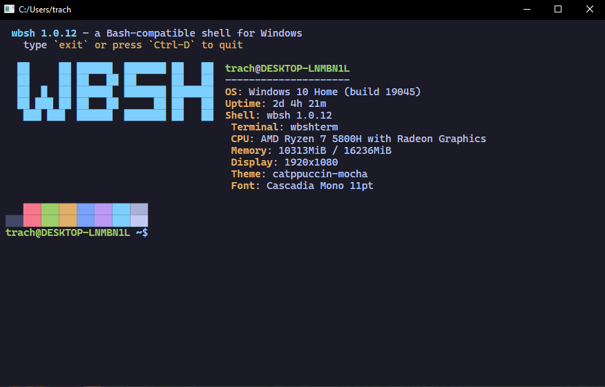

# wbshterm

A terminal for wbsh: a Win32 window that hosts an unmodified `wbsh.exe` on a
pseudoconsole, parses its VT output into a cell grid, and paints that grid
with Direct2D and DirectWrite.



**M5 is done** — the shell and the terminal talk to each other. wbsh marks
its prompts and commands, so scrollback is navigable by command and a
command's output can be copied on its own; the title bar follows the
working directory; and `fzf` hands its list over to be drawn as a real
overlay. Everything M4 brought — nine themes, any font, cursor styles, live
config — is still here. One piece remains: rewrapping text on resize.

## Install

Grab `wbshterm-setup-x64.exe` from the
[Releases](https://github.com/tomas-trachta/wbsh/releases) page. It is
per-user, needs no administrator rights, installs to
`%LOCALAPPDATA%\Programs\wbshterm`, and bundles `wbsh.exe` — the terminal
looks for the shell next to itself first, so nothing else is needed.

The optional tasks are a desktop shortcut, adding the folder to your `PATH`,
and an "Open wbshterm here" entry in the Explorer right-click menu.
`wbshterm-<version>-portable-x64.zip` is the same payload without an
installer. Your settings and themes in `%APPDATA%\wbshterm` are left alone
when you uninstall.

## Build and run

`wbshterm.vcxproj` is part of `wbsh.sln`, so Visual Studio and msbuild build
it like any other project. It depends on `wbsh`, which puts `wbsh.exe` next
to `wbshterm.exe` in `x64\$(Configuration)\` — where the terminal looks for
it first.

```powershell
msbuild ..\wbsh.sln /t:wbshterm /p:Configuration=Release /p:Platform=x64
```

`build.ps1` builds the same sources without Visual Studio, to
`wbshterm\build\`. Both paths compile at `/W4 /WX` and run the style
checker; keep them flag-compatible.

```powershell
.\build.ps1
.\build\wbshterm.exe                 # the terminal
.\tests\smoke.ps1                    # self-test, snapshot, replay determinism
```

## Modes

The window is the point, but the headless modes are how this thing is
tested — a terminal that can only be checked by looking at it cannot be
checked in CI.

| Mode | What it does |
| --- | --- |
| *(no arguments)* | Opens the window on a wbsh session. |
| `--selftest <report.txt>` | Parser and grid checks plus one live pty session; exit code is the verdict. |
| `--snapshot <out.png>` | Runs a session headlessly and paints the finished grid to a PNG. |
| `--record <out.raw>` | With `--snapshot`, also writes every byte the pty produced. |
| `--replay <in.raw>` | Parses a recording with no shell; `--dump <txt>` writes the grid as text, `--snapshot` paints it. |
| `--scroll <n>` | With `--snapshot`, scrolls back n lines before painting. |
| `--select <r:c-r:c>` | With `--snapshot`, highlights a selection in absolute rows. |
| `--config <path>` | Uses this settings file instead of the one in %APPDATA%. |

`--feed "ls --color\r"` types into any session (`\r` is Enter, `\e` is
Escape, and `\x1b[A` spells any byte), `--size 100x30` sets the grid, and
`--shell` / `--args` pick a different program to host.

Record-then-replay is the test strategy: a recording is deterministic, so a
grid dump taken from one is a golden file, and a rendering bug can be told
apart from a parsing bug by replaying the same bytes.

```powershell
.\build\wbshterm.exe --snapshot out.png --feed "ls --color -la\r" --size 100x24
.\build\wbshterm.exe --replay session.raw --dump grid.txt --size 100x24
```

## Modules

| File | Responsibility |
| --- | --- |
| `pty.h/.cpp` | `PtySession`: pseudoconsole, pipes, child lifetime. |
| `vtparse.h/.cpp` | Bytes to VT actions (DEC state machine) and UTF-8 decoding. |
| `screen.h/.cpp` | The cell grid: printing, cursor motion, erase, scroll, SGR, query replies. |
| `keymap.h/.cpp` | Key presses to bytes: modifiers, cursor-key modes, paste bracketing. |
| `view.h/.cpp` | What the window looks at: scroll position and selection, in absolute rows. |
| `scrollbar.h/.cpp` | The thumb in a pane's margin: rows to pixels, and back for a drag. |
| `config.h/.cpp` | The settings file: parsing, defaults, and the file written on first run. |
| `theme.h/.cpp` | The built-in colour schemes. |
| `titlebar.h/.cpp` | Where the caption's lights sit, and what the pointer is over. |
| `menu.h/.cpp` | The right-click menu: what it offers, and what a click meant. |
| `picker.h/.cpp` | The overlay list: fuzzy matching, filtering and selection. |
| `charwidth.h/.cpp` | How many cells a character takes: zero, one or two. |
| `session.h/.cpp` | Pty + parser + grid + reader thread; the grid is touched by one thread only. |
| `pane.h/.cpp` | One shell in a rectangle: its session, view and overlay. |
| `pane_tree.h/.cpp` | The split layout: splitting, closing, and slicing the client area. |
| `font.h/.cpp` | DirectWrite faces and the measured cell box. |
| `render.h/.cpp` | Direct2D painting of a grid onto any render target. |
| `window.h/.cpp` | The Win32 window and its frame, message handlers, key encoding, pane commands, and the status bar. |
| `snapshot.h/.cpp` | Off-screen WIC target and PNG encode. |
| `replay.h/.cpp` | Recording in, grid out, no shell involved. |
| `selftest.h/.cpp` | The headless checks. |
| `main.cpp` | Argument parsing and mode dispatch. |

## Input

`keymap.cpp` holds the encoding and nothing else — no window, no state — so
every combination is unit-tested rather than tried by hand.

| Key | Sent |
| --- | --- |
| Arrows, Home, End | `CSI A`…`CSI F`, or `SS3` in application cursor mode (DECCKM) |
| With modifiers | `CSI 1;<mod><final>`, where mod is 1 + shift + 2·alt + 4·ctrl |
| Insert, Delete, PageUp/Down | `CSI 2~`, `CSI 3~`, `CSI 5~`, `CSI 6~`, modified as `CSI 3;2~` |
| F1–F4 / F5–F12 | `SS3 P`…`SS3 S` / `CSI 15~`…`CSI 24~` |
| Backspace | DEL (0x7f); Ctrl+Backspace sends BS (0x08) |
| Ctrl+Space | NUL |
| Shift+Tab | `CSI Z` |
| Alt+*key* | the key's bytes, ESC-prefixed |
| Ctrl+V, Shift+Insert | paste, wrapped in `CSI 200~`/`CSI 201~` when the shell asked for bracketed paste |

Plain typing is deliberately *not* encoded here: a press that carries no
meaning of its own falls through to the character message Windows already
produced, which is how layouts, dead keys and AltGr keep working without
this file knowing they exist. The one wrinkle is that Windows also produces
a character for a few keys that are handled here — Ctrl+Space, Shift+Tab,
Ctrl+V — so those, and only those, swallow the character that follows.

### The right Alt key

On a layout that uses the right Alt as AltGr — Czech, German, most of
Europe — Windows spells it as Ctrl+Alt, and a key that has no third-level
character produces nothing at all. Left to itself the press would vanish,
so the window looks the key up in the layout: where AltGr gives it a
character (`@` under V on a Czech keyboard) that character is typed, as it
is; where it gives none, the key goes out as Alt plus its own letter, the
way the left Alt would send it. Programs whose shortcuts want Alt on every
key can have it:

```ini
[keyboard]
right_alt = meta   # altgr is the default described above
```

With `meta` the right Alt is plain Alt everywhere, and the layout's AltGr
characters are typed from the other layout, or not at all.

## The startup panel

Opening a session prints a screenfetch-style panel: the wbsh logo, who and
where you are, the OS build, uptime, CPU, memory, display, and which theme
and font this terminal is using — then the sixteen palette colours, so a
theme shows itself off as the session opens.

Turn it off in the config:

```ini
[startup]
fetch = false
```

The panel is `wbshterm --fetch`, run by the shell rather than drawn by the
terminal: ConPTY owns the screen, so anything the terminal painted itself
would be wiped by the shell's first repaint. wbshterm sets
`WBSH_INIT_COMMAND`, which wbsh runs once its session is up, just after
`.wbshrc`. Run `wbshterm --fetch` yourself any time.

## Making it yours

**Right-click the terminal.** The menu carries the settings people actually
reach for — theme, font, font size, cursor style and blinking, opacity,
padding — plus Copy and Paste, and it ticks whatever is currently set. The
Font entry lists every monospace family installed on the machine; a face
named in the config that is not among them is listed too, so the tick
always has somewhere to go. The last two
entries open the configuration file and the themes folder, creating the
folder and its example if they are not there yet. A choice
applies at once *and* is written back to the config file, so it is still
there tomorrow; the rest of the file, comments included, is left exactly as
you wrote it. The last entry opens the file itself in your editor.

`Ctrl+=` and `Ctrl+-` change the font size from the keyboard, `Ctrl+0`
puts it back.

The first run writes a commented config to
`%APPDATA%\wbshterm\wbshterm.conf` and watches it: save the file and the
terminal picks the change up within a second, no restart. `--config <path>`
points at a different one.

```ini
[font]
family = Cascadia Mono
size = 11
line_height = 1.15
fallback = Segoe UI Emoji, Microsoft YaHei UI, Segoe UI Symbol

[window]
padding = 10
opacity = 0.95

[cursor]
style = bar        # block, bar or underline
blink = true

[theme]
name = tokyo-night
foreground = #C0CAF5    # anything set here overrides the named theme
```

Nine schemes ship: `catppuccin-mocha` (the default), `tokyo-night`,
`dracula`, `nord`, `gruvbox-dark`, `one-dark`, `solarized-dark`,
`solarized-light`, `vscode-dark`.

### Your own themes

The themes folder holds every shipped theme as a file — `nord.conf`,
`dracula.conf` and the rest — so you can read them, edit them, or copy one
as a starting point. Right-click and choose **Open themes folder…** to get
there.

Editing a theme's file changes that theme, and the terminal picks the change
up within a second like any other setting. Delete a file and the built-in
comes back. Add `midnight.conf` and you have a theme called `midnight`,
listed in the menu beside the others and selectable with `name = midnight`.

A theme file is the same text as the `[theme]` section, so either can be
pasted into the other; a section header in it is ignored. Every key is
optional, and colours written in `wbshterm.conf` still win over the theme
they name.

A theme is nothing but twenty colours — `background`, `foreground`,
`cursor`, `selection`, and `ansi0` through `ansi15` — and every one of them
is a key you can set yourself. `name` picks the starting point; anything you
write alongside it wins, wherever in the section you write it. Leave `name`
out entirely and the twenty keys are yours alone:

```ini
[theme]
background = #11121B
foreground = #C8D0E0
cursor     = #F2CDCD
selection  = #3A3F58
ansi0 = #11121B
ansi1 = #F07178
# ... through ansi15
```

Colours are resolved when a cell is painted, not when the text arrived, so
switching themes recolours what is already on screen rather than only what
comes next.

Previewing a theme needs no window:

```powershell
.\build\wbshterm.exe --snapshot preview.png --config theme.conf --feed "ls --color\r"
```

## Text that is not ASCII

`charwidth.cpp` decides how many cells a character claims — zero for
combining marks, two for CJK, fullwidth forms and emoji — and the grid
keeps a trailing cell for the second half so the shell and the terminal
agree about where the cursor is. Glyphs the main font lacks come from the
`fallback` families, and colour emoji are drawn in colour where the target
supports it.

## What the shell tells the terminal

This is the part a generic terminal cannot do. wbsh emits semantic marks —
OSC 633, the same codes VS Code uses — around every prompt and command, and
OSC 7 whenever the working directory changes. Terminals that do not know
them ignore them, so wbsh loses nothing elsewhere.

| The shell says | The terminal does |
| --- | --- |
| `OSC 633;A` | Remembers where this prompt began |
| `OSC 633;C` | Remembers where the command's output began |
| `OSC 633;D;<exit>` | Closes the block and records how it ended |
| `OSC 7;file://…` | Puts the working directory in the title bar |
| `OSC 1337;pick;…` | Draws the picker as an overlay and answers with the choice |
| `OSC 1337;tmux;attach` | Starts pane mode, the way typing `tmux` does |
| `OSC 1337;clear;scrollback` | Forgets the scrollback; ConPTY drops the `ED 3` that `clear` sends |

That turns a wall of scrollback into a list of commands:

| Action | Binding |
| --- | --- |
| Previous / next command | Ctrl+PageUp, Ctrl+PageDown |
| Copy the last command's output | Right-click → Copy last command output |

Jumping scrolls a command's prompt to the top of the window, so its output
reads from there down. Copying the output takes exactly that — not the
command line above it, not the prompt below.

### The picker

Run `fzf` and the list opens as an overlay along the bottom of the window
rather than being painted with escape codes: type to filter, Up/Down or
PageUp/PageDown to move, Enter to choose, Escape to back out. The shell
sends its candidates over and waits; the terminal answers with the line
that was picked, and `fzf` does what it always did with it — `cd` into a
directory, open a file, print anything else.

wbshterm advertises this by setting `WBSHTERM_PICKER=1` for the shell. Run
wbsh anywhere else and the variable is absent, so its own in-console picker
runs exactly as before.

Matching prices every character by what it takes to reach: a run of
adjacent letters earns, a word boundary earns, and a jump over unrelated
text pays for the distance it skipped. Without that price `wbsh` scores as
well spelled out across `Josha_paid/website/index.html` as it does against
`wbsh/src/screen.cpp`, which is how a query ends up looking like it matched
nothing it meant. Typing only narrows, so each keystroke re-scores what
already matched rather than the whole tree; the list itself holds up to
200,000 entries, and the overlay marks the count with a `+` when the shell
offered more than that.

The handover is four sequences:

| Sequence | What it means |
| --- | --- |
| `pick;begin;<prompt>` | A request starts |
| `pick;list;<path>` | The candidates, as a file with one per line |
| `pick;item;<text>` | One candidate — used when no file could be written |
| `pick;end` | The overlay opens |

Each of those shapes works around something ConPTY does. It forwards only a
few kilobytes of a sequence it has no meaning for before dropping the rest,
which truncated any list past roughly 300 entries and lost the `end` that
opens the overlay with it — so a long list travels as a file, and only its
path goes through the console. The request is written to `CONOUT$` rather
than stdout, because in `ls | fzf` stdout is the pipe and the terminal would
never see it; the answer is read back from `CONIN$` for the same reason.
And conhost passes such a sequence on only once something else moves the
screen along, so the request ends with a save and restore of the cursor —
a nudge that leaves nothing on screen.

## The window's own frame

wbshterm draws its caption rather than letting Windows draw one: a slim bar
in the theme's own colours, the title centred in a proportional face, and
three round lights on the right — zoom, minimise, close, with close
outermost where Windows users reach for it. Hovering the cluster brings up
the marks inside them; pressing one darkens it, and sliding off before
letting go takes the press back.

```ini
[titlebar]
custom = true       # false for the ordinary Windows frame
buttons = right     # or left, the way macOS has them
height = 38
```

The caption is a real one: dragging it moves the window, double-clicking
zooms it, Aero Snap works, and right-clicking opens the system menu that a
custom frame would otherwise take away. `Alt+Space` is deliberately *not*
claimed for that menu — readline binds it, and a terminal has no business
taking a key its own shell is already using.

Underneath, `WM_NCCALCSIZE` keeps the whole window as client area, and
`WM_NCHITTEST` hands the edges back so the window still resizes. Maximised,
the frame Windows adds is subtracted again, so the grid lands exactly on
the work area instead of spilling past the screen and over the taskbar.

**Rounded corners depend on the Windows version.** Windows 11 rounds them
itself through `DWMWA_WINDOW_CORNER_PREFERENCE` — antialiased, with the
shadow following the shape. Windows 10 rejects that attribute, so the
corners are cut out of the window instead with a region: the same shape,
but a hard edge rather than a smooth one, and no shadow. The code asks DWM
first and only falls back when it refuses, so a Windows 11 machine gets the
good version without a switch to set.

The same split decides one more thing. `DWMWA_BORDER_COLOR` is Windows 11
only, so on Windows 10 the sliver of frame that would buy a drop shadow is
drawn by DWM in its own accent colour — a bright hairline across the top of
a window with no caption to justify it. There the frame is left alone and
the cut-out corners stand on their own.

## Panes

Type `tmux`. A status bar appears, the prefix key comes alive, and the
window starts holding a tree of panes — each with its own shell, grid,
scrollback and selection. Until then `Ctrl-B` is the shell's, which is
the point: it is a line-editing key right up to the moment it is not.

This is the half of tmux a terminal can do better than a multiplexer:
splits, layout and a status bar, drawn by the thing that owns the pixels.
It is not the other half. There is no server, no detach, no reattach, and
nothing that outlives the window. For a session that survives its
terminal, or one on the far side of an SSH connection, run the real tmux
there — this does not replace it and does not pretend to.

| After the prefix | Does |
| --- | --- |
| `%` or `\|` | Split into columns, side by side |
| `"` or `-` | Split into rows, one above the other |
| Arrows, or `h` `j` `k` `l` | Move the focus that way |
| `o` | Focus the next pane |
| `z` | Zoom the focused pane to the window, or put it back |
| `x` | Close the focused pane |
| `Ctrl-B` | Send the prefix on to the shell |

Press the prefix, let go, then press the command key — the tmux habit.
A command is read from the *character* a key produces rather than from
the key itself, so `%` and `"` stay on the keycaps that print them on any
layout; the arrows are read from the key, since they print nothing.

A split inherits the focused pane's working directory, which the shell
reports through OSC 7, so a new pane opens where you were rather than at
home. The startup panel is not repeated in it.

The mouse follows the pane under it: clicking focuses, dragging selects
within that pane, and the wheel scrolls whatever the pointer is over
rather than whatever has the focus — reading one pane while another works
is most of the reason to split at all. Dividers drag, and the pointer
turns into a sizing cursor over one.

```ini
[panes]
prefix = ctrl+b     # ctrl / alt / shift in any order, then one key
divider = 6         # pixels between panes
focus_border = true # outline the focused pane when there is more than one
status = true       # the bar along the bottom
```

### How `tmux` reaches the terminal

`tmux` is a wbsh builtin, not the real one. wbshterm sets `WBSHTERM_PANES`
in the environment, and the builtin only speaks up when it finds it —
anywhere else it says so and exits non-zero rather than silently doing
nothing. When it does fire it writes `OSC 1337 ; tmux ; attach` to the
console device, the same channel the picker overlay uses, and wbshterm
starts pane mode on the way through its parser.

Only a bare `tmux` is accepted. `tmux split-window`, `tmux attach` and the
rest are refused with a line explaining there is no server, because a
subcommand that silently did nothing would be worse than one that says
why it cannot.

Four things are worth knowing about the shape of this:

**One pseudoconsole per pane.** Each pane is a ConPTY, and each ConPTY
brings its own `OpenConsole.exe` — panes cost more on Windows than they do
on a system with real ptys. Eight of them is fine; eighty is not.

**Resizes are debounced.** Resizing a pseudoconsole makes its child
repaint everything it is showing, so dragging a divider or the window edge
re-lays out and repaints immediately but tells no pty anything until the
pointer settles. This is why a pane's text lags its rectangle for a moment
mid-drag.

**Scrollback is per pane.** The configured limit applies to each of them,
so the memory a window can hold scales with how many panes are in it.

**A split does not rewrap** — see [Remaining](#remaining). A pane that
changes width carries its text over rather than reflowing it, the same
thing that happens when the window is resized.

## Scrollback and selection

Lines that scroll off the top are kept — 10,000 of them — and the view
addresses scrollback and the live grid as one coordinate space, so a
selection stays on the text it was made on no matter what arrives
afterwards.

| Action | Binding |
| --- | --- |
| Scroll | Wheel, Shift+PageUp/PageDown, Ctrl+Shift+Up/Down, or drag the scrollbar |
| Select | Drag; double click for a word, triple for the line |
| Copy | Ctrl+Shift+C, Ctrl+Insert |
| Customise | Right-click, or Shift+F10 |
| Font size | Ctrl+=, Ctrl+-, Ctrl+0 |
| Return to the bottom | Type anything |

A thin scrollbar sits in each pane's right margin once there is history to
scroll into. It lights up under the pointer, the thumb drags, and a press on
the track jumps there. `clear` (and `Ctrl-L`) discards the scrollback along
with the screen, so scrolling up afterwards finds nothing.

Two behaviours are deliberate. New output does **not** yank the view back
to the bottom while you are reading history — the scroll offset grows by
however many lines arrived, so the text under your eyes stays put — and the
cursor is not painted while scrolled back, because it belongs to the live
grid rather than to what is on screen.

## Remaining


**Text does not rewrap when the window is resized.** Content is carried
over — the grid keeps what fits and pushes the rest into scrollback — but a
line that wrapped at the old width stays broken where it was. Rewrapping
needs the grid to record where a line continues, which is the next piece of
work here.

## Things learned the hard way

**The child needs `STARTF_USESTDHANDLES` with all three std handles null**
(M0). Without it — and the SDK's own EchoCon sample omits it — the child
inherits *this* process's standard handles on Windows 10 22H2. The failure
is peculiar: the child is genuinely attached to the pseudoconsole, so `mode
con` reports the pty's size, while everything it writes to stdout bypasses
the pty and lands in the host's output. Only explicit `> CON` writes come
back. `--selftest` guards it.

**Queries must be answered.** Full-screen applications send DA1 (`ESC[c`),
DA2 (`ESC[>c`) and DSR/CPR (`ESC[6n`) and change behaviour based on the
reply — or on its absence. `Screen` answers them through a `VtResponder`,
which `Session` implements by writing back into the pty.

**ConPTY output is conhost's rendering, not the application's.** What
arrives on the pipe is regenerated from conhost's own buffer, so an oddity
in the stream is not necessarily a bug in this terminal: vim under ConPTY
emits `ESC[67C` followed by a literal `m`, and every conformant terminal
(this one, Windows Terminal) paints that `m`.

**ConPTY throughput is ~1.5 MB/s** (M0: 989 KB in 634 ms). The pty, not the
renderer, is the ceiling on a large dump. The reader thread only buffers
bytes and posts one wake-up at a time; parsing and painting happen once per
drain on the UI thread.

**A frame arrives in pieces, and painting between them is the flicker.**
A full-screen program such as Claude Code redraws its whole panel at once,
but the pseudoconsole hands it over as several writes a moment apart, and
the default four-kilobyte pipe chops a busy screen into more. Painting
after each piece showed a half-cleared panel for a frame. The pipe is a
megabyte now, the read buffer a quarter of that, and the reader waits a
couple of milliseconds for the rest of a burst before waking the window —
never more than eight, so typing does not lag. A program that asks for
synchronized output (`CSI ?2026h`… `CSI ?2026l`, answered through DECRQM)
is painted only once its frame is closed, with a grace timer so a frame
left open can never freeze the window. Runs of text keep their DirectWrite
layouts between frames, so a repaint draws shaped runs it already has
rather than shaping every row again.

**Backspace is DEL, not BS.** ConPTY follows the xterm convention: 0x7f
is Backspace and 0x08 is Ctrl+Backspace. Windows hands the window 0x08
for a plain press, so passing the character message straight through
arrives at the shell as Ctrl+Backspace and erases a word, or nothing.
Backspace and Delete both have live checks in `--selftest` now.

**Astral characters cannot be typed into wbsh.** Paste or type an emoji
and the shell echoes U+FFFD twice, once per UTF-16 half — the bytes are
already replacement characters when they come back out of the pseudoconsole,
so nothing downstream can recover them. The same emoji printed *by* the
shell (`cat` a file containing one) arrives intact and renders correctly, so
this is wbsh's line editor reading key events one UTF-16 unit at a time, not
a terminal bug.

**ConPTY never forwards the alt screen.** `less` and `vim` under a
pseudoconsole never produce `CSI ?1049h`: conhost renders them into its own
main buffer and streams the result, so the switch never crosses the pipe.
The alt screen is implemented and unit-tested here for streams that do use
it, but under ConPTY the behaviour that matters is what `--selftest`
checks — quitting a pager leaves a working prompt and the scrollback that
was there before.

**A resize is not real until the shell sees it.** `ResizePseudoConsole` is
only half of it: wbsh republishes `COLUMNS` when it next draws a prompt, so
a test that resizes and immediately asks reads the old width. The check in
`--selftest` gives it a prompt first.

**A shell that exits does not close the pipe.** ConPTY holds the output
pipe open after the child is gone, so a reader waiting on bytes never learns
the shell quit — the window stayed open on Ctrl-D while `exit` worked, since
that path happened to produce output first. The session now waits on the
child process as well as on its output, and closes the window either way.

## Teardown order

`read()` returns 0 only once the pseudoconsole is closed, and `close()`
releases the handle readers are blocked on. So the sequence is
`endSession()`, then join every reader, then `close()` — which is what
`Session::stop()` does.
